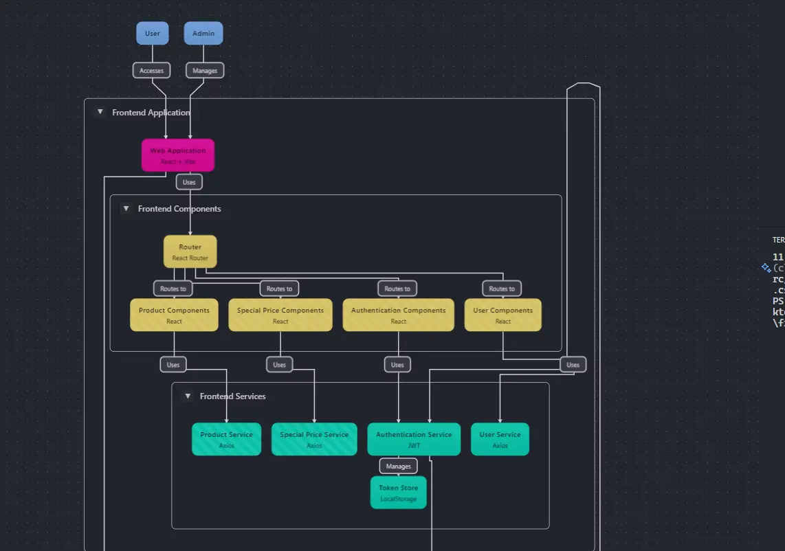

# Front End

### introduccion

Proyecto tipo tienda con productos, precios especiales y usuarios.
Lenguaje: TypeScript
Se eligió TypeScript en el frontend debido a su capacidad para detectar errores en tiempo de desarrollo, lo que mejora la mantenibilidad y escalabilidad del código. Además, permite un mejor autocompletado y documentación en los editores de código, facilitando la colaboración en el proyecto.
Estilos: Implementación de [TailwindCSS] para mejorar la apariencia y optimizar el desarrollo.

> Iniciar proyecto.
>
> > Bun install.
> > Bun dev.
>
> - Repositorio Back: https://github.com/brayang222/drenvio-BackEnd
> - Despliegue Back: https://drenvio-back-end.vercel.app/

